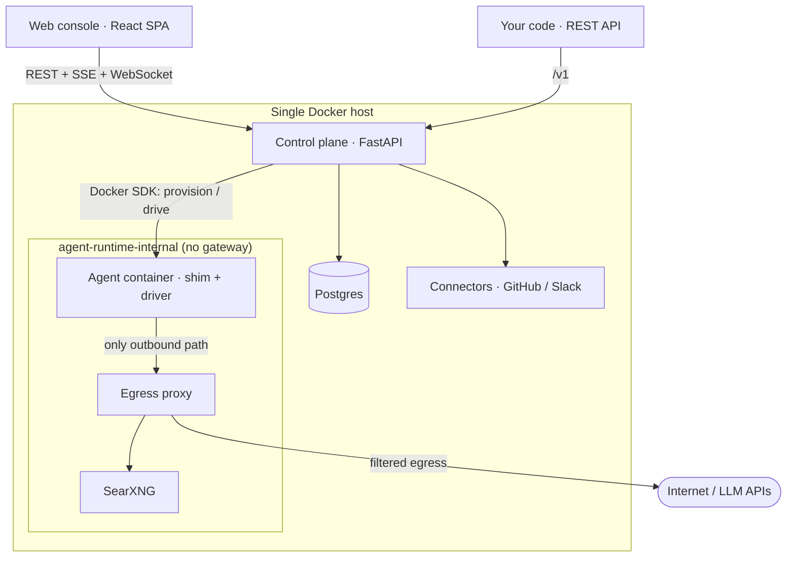

<div align="center">

# Agenhood

### Self-hosted infrastructure for a fleet of sandboxed, long-lived AI agents

Provision autonomous AI agents once, then task, schedule, and chain them — each in its own hardened Docker container with a persistent workspace, internet access, and a pluggable "brain." Watch every action stream live from a polished web console or a clean REST API. **You own the agents, the data, and the stack.**

[](LICENSE)
[](https://github.com/appssemble/agenhood/actions/workflows/ci.yml)
[](https://www.python.org/)
[](https://fastapi.tiangolo.com/)
[](https://react.dev/)
[](https://www.docker.com/)
[](#contributing)

</div>

<!-- Add a hero screenshot or GIF of the live task viewer / fleet grid here:
<p align="center"></p>
-->

---

## Why Agenhood?

Chat assistants forget. Agent CLIs are throwaway. Neither runs unattended on infrastructure you control.

Agenhood sits between **chat assistants** (ChatGPT, Claude) and **dev-agent CLIs** (Codex, opencode, Claude Code) and gives them an operational home: a persistent, multi-tenant, observable **fleet** of AI agents that live on **your** server.

- **Long-lived, not ephemeral** — agents keep a writable workspace volume across restarts, pauses, and weeks of idle. Files, memory, and history persist.
- **Sandboxed by default** — every agent runs in its own hardened container: read-only root filesystem, dropped Linux capabilities, egress filtering (private ranges & cloud-metadata endpoints blocked), and CPU/memory limits. An unhinged agent can't harm the host or your other agents.
- **Pluggable brains (drivers)** — one identical API, swappable execution engines. Pick the right brain per agent.
- **Self-hosted & yours** — single-VM deploy, your keys, your data. No vendor lock-in, no per-seat SaaS tax, no data leaving your stack.
- **Built for humans *and* machines** — everything in the console is a first-class REST API + Server-Sent-Events stream. The console is just one client of that API.
- **General-purpose** — research, drafting, web automation, document production, data work — not just code diffs.

## Table of contents

- [Features](#features)
- [Architecture](#architecture)
- [Tech stack](#tech-stack)
- [Quick start](#quick-start)
- [Using the API](#using-the-api)
- [Running Agenhood: development vs production](#running-agenhood-development-vs-production)
- [Working on the code](#working-on-the-code)
- [Project layout](#project-layout)
- [Contributing](#contributing)
- [Security](#security)
- [License](#license)

## Features

### 🛰️ The agent fleet
Provision agents from **templates** or from scratch in seconds. A live fleet grid shows every agent with its status, driver, model, and last activity. Clear lifecycle states — `running`, `paused`, `archived`, `error` — with actions to pause (optionally cancelling in-flight work), resume, archive, restore, recover, and delete. **Idle agents auto-pause** to save resources and **auto-wake on the next task**.

### 🧠 Pluggable drivers — swappable brains
One identical API, multiple execution engines, hot-swappable per agent via a driver registry:

| Driver | What it is |
| --- | --- |
| **Vanilla** | A built-in tool-use loop you fully control — pick the tools, write the system prompt, tune iteration/token budgets. |
| **Opencode** | An embedded coding harness that manages its own tools and context. |
| **Codex** | OpenAI's Codex agent, with skill support. |
| **Claude Code** | Anthropic's agent via `claude -p`, including subscription OAuth ("Connect Claude Code"). |

New brains drop in without changing the public API.

### 📡 Tasks — submit, stream, observe
Submit a task via a clean form or a streaming chat thread. Output contracts can be free-text or **schema-validated JSON**. The **live task viewer** streams the agent's assistant messages, tool calls, tool results, and file changes in real time over Server-Sent Events — with a live token meter, iteration count, elapsed timer, and mid-flight cancel. Reconnects resume exactly where they left off.

### 🔁 Workflows & ⏰ schedules
Chain tasks into ordered **workflows** across one or more agents, with a visual pipeline view and per-run success metrics. **Schedule** a prompt or a whole workflow on a cron-like cadence (one-time or recurring, timezone-aware), and see upcoming fires on a calendar.

### 💾 Persistent workspace, snapshots & Git backup
Each agent owns a `/workspace` volume that survives restarts, pauses, and archival — browse, upload, and download files from the console. **Automatic snapshots** after every task give you a restore-point timeline with non-destructive rollback, plus an optional **Git backup remote** (SSH deploy key, push-on-completion).

### 🧩 Tools, skills & MCP
The vanilla driver ships a tool palette: read/write/edit/list files, run **bash** and **Python**, **web search** (self-hosted [SearXNG](https://github.com/searxng/searxng) by default), and **web fetch** (text or headless-Chromium-rendered). Extend agents with reusable **skills** (inline or sourced from a Git repo — multi-skill repos install in one pass, and private repos are supported via per-workspace SSH deploy keys) and **[Model Context Protocol](https://modelcontextprotocol.io) (MCP)** servers.

### 🏢 Multi-tenant workspaces
Multi-tenant from day one. Every resource is scoped to a workspace; a user can belong to several and switch via a header picker. Per-workspace roles: **owner / admin / member**.

### 🔐 Credentials & security
LLM provider keys are stored server-side, **encrypted (AES-GCM), and never sent to the browser** — the UI shows only provider + last-4. OAuth connect flows for Claude / ChatGPT subscriptions (paste-code PKCE). Named, revocable **API keys** with a one-time secret reveal.

### 📊 Dashboard, in-browser shell & command palette
A usage dashboard (tokens, tasks, success rate, trends), an **in-browser terminal** into any running agent (xterm over WebSocket), a **⌘K command palette**, and a live API activity panel for debugging.

## Architecture

Agenhood is a small monorepo of independently-deployable services around a shared core library. Agents are **runtime-provisioned Docker containers**, not compose services — the control plane creates and drives them on demand.



- **`agentcore`** — shared Python library: agent/task models, the driver & tool interfaces, the provider-agnostic LLM client, event schema, and sandbox limits.
- **Shim** — PID-1 inside every agent container. Runs the selected driver, executes tools, and streams events back to the control plane.
- **Control plane** — stateless FastAPI service. Owns the public API, authenticates principals (tenant API keys, user/staff sessions), persists to Postgres, drives the Docker daemon to provision containers, and proxies/streams task events.
- **Connectors** — standalone GitHub/Slack service with its own database and OAuth.
- **Web console** — a React + TypeScript + Vite SPA; a pure client of the control-plane API.
- **Egress proxy + SearXNG** — the single, filtered outbound path; agents attach to an internal network with **no gateway** so the proxy is their only route out.

## Tech stack

**Backend:** Python 3.12 · FastAPI · Pydantic · httpx · Postgres · Alembic · the Docker SDK
**Frontend:** React 18 · TypeScript · Vite · TanStack Query · Tailwind · xterm.js
**Infra:** Docker & Docker Compose (no Kubernetes required) · SearXNG · Traefik · optional [Coolify](https://coolify.io) deploy
**Tooling:** ruff · mypy (strict) · pytest · Vitest · Playwright

## Quick start

**Prerequisites:** Docker (with the daemon running) and Python 3.12+.

```bash
git clone https://github.com/appssemble/agenhood.git
cd agenhood
make dev
```

`make dev` is turnkey: it builds the agent image, starts the stack in **development mode** (hot reload, insecure local defaults — nothing to configure), runs migrations, seeds a tenant, creates a login, and prints the URL. For a real deployment, see [Running Agenhood: development vs production](#running-agenhood-development-vs-production).

```
Console:  http://localhost:5173
Login:    admin@example.com / devpassword123   (you'll change it on first login)
API key:  tk_live_seedkey                       (seed tenant, for API use)
```

Add an **Anthropic API key** (or connect a subscription) in **Settings → Credentials**, provision an agent, and hand it a task. Provisioning takes **under 5 seconds**.

```bash
make logs    # tail dev logs
make stop    # stop dev, keep data, remove dangling agent containers
```

## Using the API

Everything the console does is available over the REST API + SSE — the console is just one client. Create a task and stream its events live:

```bash
# Submit a task to an agent (agents are "containers" in the API)
curl -X POST http://localhost:5173/v1/containers/$AGENT_ID/tasks \
  -H "Authorization: Bearer tk_live_seedkey" \
  -H "Content-Type: application/json" \
  -d '{"prompt": "Summarize the latest release notes and save them to notes.md"}'

# Stream the live event feed (assistant messages, tool calls, file changes)
curl -N http://localhost:5173/v1/containers/$AGENT_ID/tasks/$TASK_ID/events \
  -H "Authorization: Bearer tk_live_seedkey"
```

## Running Agenhood: development vs production

Both modes are driven by a single `make` command that wraps Docker Compose. They differ in the env file they load, the service topology they bring up, and how you reach the console. **Both auto-build the agent image on first run and apply database migrations for you.**

| | **Development** — `make dev` | **Production** — `make prod` |
|---|---|---|
| For | Trying it out & hacking locally | A real deployment on your VM |
| Env file | `deploy/.env.dev` — committed, insecure defaults, **nothing to fill in** | `deploy/.env` — **you create it** from `.env.example` with real secrets |
| Console | Vite dev server, hot reload — <http://localhost:5173> | Built SPA behind Traefik at `https://$PUBLIC_HOST` |
| TLS & routing | None; plain HTTP on localhost | Traefik + Let's Encrypt; API on the same origin under `/v1` |
| First login | Auto-seeded tenant + admin login | You provision it (admin/staff — no public signup) |
| Reverse proxy / connectors | Not started | Traefik + `connectors` included |
| Compose files | `docker-compose.yml` + `docker-compose.dev.yml` | `docker-compose.yml` |

### Development (`make dev`)

The fastest path — this is what [Quick start](#quick-start) runs.

```bash
make dev     # first run: build agent image, start stack, seed a login, print the URL
make logs    # tail dev logs
make stop    # stop dev, keep data, clean up dangling agent containers
```

The control plane runs with `--reload` and the console is a hot-reloading Vite dev server on <http://localhost:5173> (it proxies `/v1` and `/admin` to the control plane). All secrets come from the committed `deploy/.env.dev` — **safe for local use only, never for production.** Add an **Anthropic API key** in **Settings → Credentials** before running tasks.

### Production (`make prod`)

Runs on **plain Docker on a single VM** — no Kubernetes, no orchestrator. The full stack comes up behind Traefik (TLS via Let's Encrypt) at your public host.

```bash
cp deploy/.env.example deploy/.env      # 1. create your env file
#   2. fill in real secrets — every "change-me" must be replaced. Generator
#      commands are inline in the file: CREDENTIAL_ENCRYPTION_KEY,
#      CONNECTORS_MASTER_KEY, ADMIN_API_KEY, the DATABASE_URL password,
#      SEARXNG_SECRET, and PUBLIC_HOST (your DNS name).
make prod                               # 3. build + start the full stack
make smoke                              # 4. optional: health & egress smoke checks
```

`make prod` refuses to start if `deploy/.env` is missing or still contains any `change-me` placeholder. Point your domain's DNS at the VM and open ports **80/443** so Traefik can obtain certificates; the console is then served at `https://$PUBLIC_HOST` with the API on the same origin under `/v1`. Stop with `make prod-stop` — data is preserved in the `pgdata` volume.

> [!IMPORTANT]
> Agenhood was built for a trusted, self-hosted deployment. Review the sandbox, egress, and credential settings against your own threat model before exposing it publicly. Accounts are provisioned by admins/staff — there is no public self-signup.

**More deploy detail:** compose topology and verification steps in [`deploy/README.md`](deploy/README.md), a managed [Coolify](https://coolify.io) path in [`deploy/COOLIFY.md`](deploy/COOLIFY.md), and VM sizing in [`deploy/SIZING.md`](deploy/SIZING.md). The agent image ships in **two variants** — `full` (headless Chromium for JS-rendered web fetch) and `slim`.

## Working on the code

Setup for contributing to Agenhood itself — linters, type checks, and tests. This is separate from *running* the app (above); you only need it when editing the source.

```bash
python3.12 -m venv .venv && source .venv/bin/activate
pip install -e "packages/agentcore[dev]"

ruff check .                                   # lint
mypy packages/agentcore/agentcore              # types (strict)
pytest -m unit                                 # fast tests, no Docker needed
pytest -m integration                          # requires a Docker daemon
```

For the frontend:

```bash
cd web/console
npm install
npm run dev        # or: npm test / npm run typecheck / npm run lint / npm run build
```

> [!TIP]
> `npm run dev` here runs the console's Vite server standalone. To see it wired to a live backend, use `make dev` (which runs the same server against the full dev stack).

## Project layout

```
packages/agentcore   # shared library: models, driver/tool/LLM interfaces, events, limits
services/shim        # PID-1 in-container agent shim
services/control_plane  # FastAPI control plane (public API, auth, provisioning)
services/connectors  # standalone GitHub/Slack connectors service (own DB)
web/console          # React SPA (the Fleet Console)
images/              # agent + egress-proxy image build contexts
deploy/              # Docker Compose topology, prod & test stacks, Coolify runbook
```

## Contributing

Contributions are welcome. Please:

1. Open an issue to discuss substantial changes first.
2. Keep the checks green: `ruff check .`, `mypy packages/agentcore/agentcore`, `pytest -m unit`, and the web-console `typecheck` / `lint` / `test`.
3. Add tests for new behavior and keep PRs focused.

## Security

Please **do not** open public issues for security vulnerabilities. Report them privately to the maintainers (see the repository's security policy / contact). LLM provider keys are encrypted at rest and never exposed to the browser; agents run under a hardened sandbox with filtered egress.

## License

Released under the [MIT License](LICENSE).

---

<div align="center">

**Keywords:** self-hosted AI agents · autonomous agent infrastructure · sandboxed AI agents · multi-tenant agent platform · long-lived AI agents · Docker AI agents · LLM agent runtime · Claude Code · OpenAI Codex · opencode · MCP · FastAPI · agent orchestration · AI agent fleet · self-hosted LLM automation

</div>
